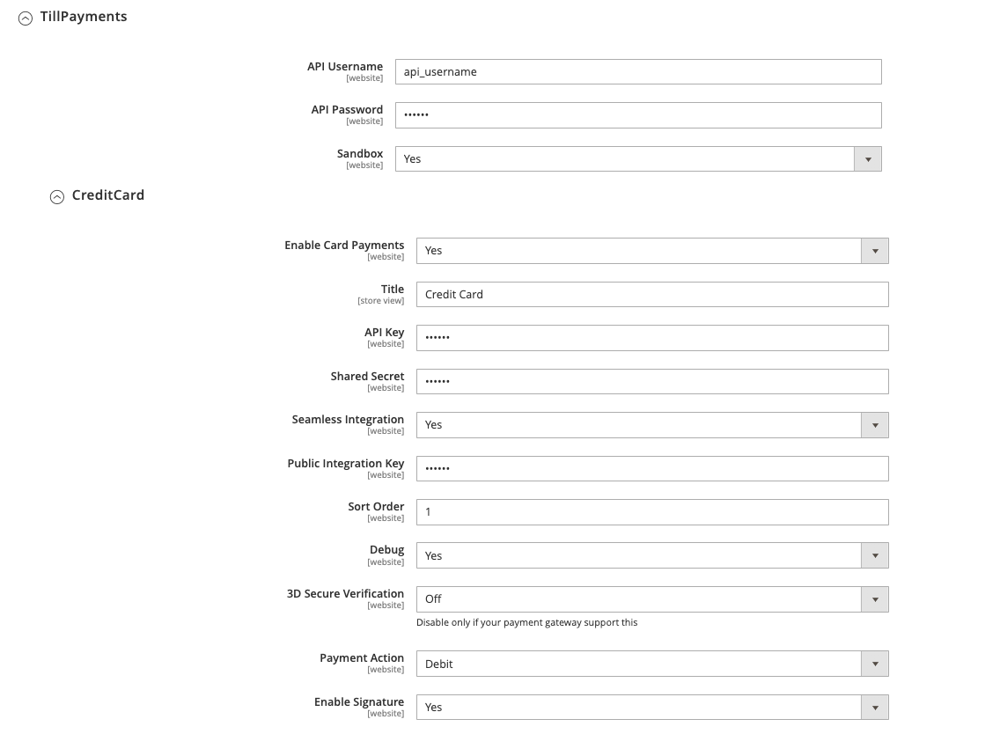

# Till Payments Magento Plugin

## Installation 

Clone this repo and copy the `TillPaymentsPlugin/` directory to your Magento path in the following location `magento/app/code/TillPayments/`

Run the installation commands as per Magento documentation to deploy the plugin

## Configuration

You will find the plugin configuration under **Stores > Configuration > Sales > Payment Methods > Other Payment Methods: > TillPayments**

See [Till Payment's Support - Gateway Credentials](https://support.tillpayments.com/till-payments-gateway-credentials) for instructions on obtaining your production credentials

## Plugin Settings

The following credentials and behaviour are configurable from this menu

* **HTTP API User**: Obtained from the Users section on the web Gateway. This must be an API username, not the web user you logged in with
* **HTTP API Password**: Password for the API User account 
* **API Key**: Obtained from your Gateway connector
* **Merchant Secret Key**: The *Shared Secret* obtained from your Gateway connector
* **Sandbox**: Yes to target our sandbox/dev endpoint, No to target our production endpoint
---
* **Enable Card Payments**: Yes to enable the plugin
* **Title**: Will be displayed to the customer at checkout when presenting payment options
* **Seamless Integration**: -
* **Integration Key**: Obtained from your Gateway connector where it is labelled as *Public Integration Key (e.g. for payment.js)*
* **Sort Order**: -
* **Debug**: Print additional information to Magento logs
* **3D Secure Verification**: 
    * **OFF** - 3D-Secure Verification is turned off. Verification can still be enabled by certain risk parameters if configured on your connector.
    * **OPTIONAL** - If the payer is enrolled into 3D-Secure program, the verification will be performed. If not, the transaction will still be processed.
    * **MANDATORY** - If 3D-Secure verification is not possible (e.g. Payer not enrolled, Server not reachable), the transaction will be declined.
* **Payment Action**: Indicates which [transaction type](#transaction-types) will be used for the order.
    * **Authorize** - Initiates the Preauthorize > Capture | Void flow, where the merchant must manually initiate a Capture to complete the payment
    * **Debit** - Typical payment flow where the customer will charged as soon as the order is completed
* **Enable Signature**: This is necessary for Magento to validate the signature of our Gateway postback so that the order status can be updated according to the payment success or failure. This should be left on.

## Transaction Types

Magento can call the following subset of our Gateway's known [transaction types](https://gateway.tillpayments.com/documentation/gateway#transaction-types).

* **Debit:** a "normal" payment. Debits the end customer with the given amount.
* **Preauthorize:** Reserves the payment amount on the customer's payment instrument.
* **Capture:** Completes a payment which was previously authorized with the Preauthorize method.
* **Void:** Cancels a previously performed Preauthorize
* **Refund:** Reverses a payment which was previously performed with Debit or Capture

## Known Issues

### Payment input fields no loading

Ensure you have entered the correct **Integration Key** and are targeting the correct environment via the **Sandbox** toggle. 

In rare cases another third party plugin can conflict with our own and introduce undesirable behaviour. Preventing the payment inputs from loading is just one example. This is usually the case when another plugin is raising exceptions and can often be diagnosed by inspecting the server logs as well as checking the browser's console for errors while the payment page is loading.

### Order status not updating

If your server has any IP restrictions in place ensure that our outbound IP address ranges are whitelisted. An updated list is maintained [here](https://gateway.tillpayments.com/documentation/ip-acl).

One of the inputs used to generate the postback header signature is your **Merchant Secret Key (Shared Secret)**. If this is entered incorrectly the signature generated by Magento will not match what is sent by our Gateway and the order status will not update even if the payment was taken successfully.

### All payments declined in testing

While targeting our sandbox environment there is a list of acceptable test cards you can use to simulate different outcomes. Using any other made up card, or a live card number, will result in a decline.

[Test Card Numbers](https://gateway.tillpayments.com/documentation/connectors#simulator-testing-connector-test-data)

## Support

For help during your integration and testing phase please contact integrations@tillpayments.com

If you encounter issues after you have launched your production Magento instance please contact support@tillpayments.com
